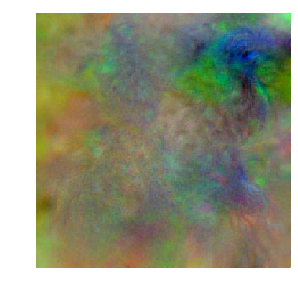

# maximal activation
- maximal activation is a simple technique which optimizes the input of a model to maximize an output response
- the code here (in `max_act.py`) shows a simple pytorch implementation of this technique
- this code includes simple regularization for this method
- one example maximizing the class "peacock" for AlexNet: 




## sample usage

```python
sys.path.append('../max_act')
from max_act import maximize_im, maximize_im_simple
import visualize_ims as viz

device = 'cuda'
model = model.to(device)
class_num = 5
im_shape = (1, 1, 28, 28) # (1, 3, 224, 224) for imagenet
im = torch.zeros(im_shape, requires_grad=True, device=device)
ims_opt, losses = maximize_im_simple(model, im, class_num=class_num, lr=1e-5,
                                     num_iters=int(1e3), lambda_tv=1e-1, lambda_pnorm=1e-1)

viz.show(ims_opt[::2])
plt.show()

plt.plot(losses)
```